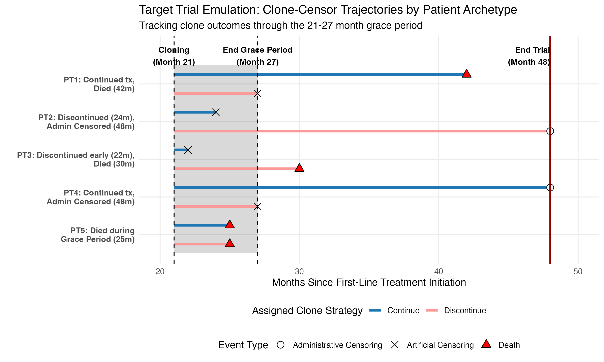

# Target Trial Emulation (TTE) using Inverse Probability Clone Censoring Weighting (IPCW) and Regularized Regression of Flatiron database for advanced NSCLC patients treated with immunotherapy

 - objective: basic risk prediction using regularized regression for outcomes 1. overall survival probability, 2. irAEs
 - covariates: patient demographics, dates of advanced cancer diagnosis, treatment dates, type of systemic therapy, ECOG performance status, comorbidities, smoking history, laboratory values (liver/renal function, tumor biomarkers), medications, and validated endpoints (mortality, real-world progression, select irAEs). 
 - adults of 18+, diagnosed with advanced bladder, kidney, melanoma, or non-small cell lung cancer (NSCLC) between 2015-2024. 
 - results stratified by: cancer type, age group, BMI, ECOG performance status, programmed death ligand (PD-L1) status, tumor mutational burden (TMB), and calendar period of ICI initiation.
  - sensitivity analysis to analyze the 2-year time-point decision of discontinuation/continuation of ICI therapy to earlier time points (e.g., 18 months).
- estimand: primary estimand is the per-protocol effect of discontinuation vs. continuation on overall survival (primary), and irAEs (secondary) at 2 years after ICI initiation.
- eligibility criteria: free from evidence of progression at start of 21st month after treatment initiation. 
- per-protocol TTE: discontinuation anywhere from 21-27th month after treatment initiation is considered as consistent with "discontinuation after 2 years" (per-protocol). 
- artificial censoring: patients assigned to "discontinue" strategy will be considered to deviate from protocol/strategy if they continue treatment (not discontinue) by 27 months. Likewise, patients assigned to "continue" strategy will be censored if discontinuation occurs prior to the end of 27 months. 
- power/sample size: estimate 7,837 patients (5,980 lung, 624 bladder, 589 kidney, and 644 melanoma) that were progression-free and initiated ICI therapy at 2-years. 2,405 discontinued at 2-year decision point, 5,432 continued ICI therapy beyond 2-years. 
- cloning: each patient is cloned at month 21, and given an assigned protocol of either discontinuation or continuation of ICI therapy. If they deviate from their assigned protocol, they are artificially censored at the time of deviation. This allows for estimation of the per-protocol effect of discontinuation vs. continuation on overall survival and irAEs at 2 years after ICI initiation.
- administrative censoring occurs exactly at 48 months after ICI initiation, clinical decision anchored at 2-year decision point, and follow-up is limited to 2-years after the 2-year decision point (i.e., 4-years after ICI initiation). In follow-up period, the study aims to estimate the difference in overall survival and irAEs over the 2-year follow-up period after the 2-year decision point. Thus, any patient who survives and remains event free at the end of the two-year follow-up period will be administratively censored at 48 months after ICI initiation.
- visual: Cloned at the start of follow-up period (21 months), and at cloning, progression-free patients is are cloned into two identical profiles: one "continue" and one "discontinue" ICI therapy. Deviating from "discontinue" protocol means that if a patient does not stop treatment by 27 months, their "discontinue" clone is censored at month 27. Likewise, if a patient deviates from "continue" protocol by discontinuing treatment prior to month 27, their "continue" clone is censored at the time of discontinuation. 

- PT1: (Continued, Died). Patient never stops treatment. Their "discontinue" clone is artificially censored exactly at month 27  (end of grace period), while their "continue" is tracked until death at month 42. 
- PT2: (Discontinued, Survived). Patient decides to stop treatment at month 24. Their "continue" clone is artificially censored at month 24. Their "discontinue" clone is tracked until end of trial (administrative censoring at month 48).
- PT3: (Discontinued Early, Died). Similar to PT2, but they stop at month 22. Their "continue" clone is artificially censored at month 22, and "discontinue" clone captures death at month 30.
- PT4: (Continued, Survived). Best-case scenario. Their "discontinue" clone is artificially censored at month 27, and their "continue" clone is successfully reaches the end of trial (48 months).
- PT5: (Died during Grace Period). A crucial edge case in TTE, since they died at month 25 BEFORE making any decision to continue or discontinue, both clones are still valid at the time of death. Both clones register the death event at month 25. 

## Aim 1 
### MODELING STRATEGY
- Aim 1, step 1: 1) descriptive analyses of patient characteristics, treatment patterns (freq and timing of treatment discontinuation), and length of available follow-up; 2) Baseline covariates summarized at start of 21st month decision window; 3) will examine distribution of discontinuation, progression, and irAEs. 4) data quality checks, missingness, internal consistency of key dates and events, plausiblility checks to ensure validity of analytic variables to inform model specification.
 - Aim 1, step 2: 1) estimate the per-protocol effect of discontinuation at 2-years vs continued ICI treatment until progression or irAE on primary outcome of overall survival using pooled logistic regression with IPCW to account for artificial censoring due to deviation from assigned strategy. Confounding eliminated due to all patients assigned both treatment strategies at baseline (cloning), and adjustment for confounding is incorperated into models for the censoring process rather than treatment assignment or outcome models.
 - fitted logistic model will estimate: 1) standardized survival curves under each treatment strategy and use these to calculate the primary estimand of interest: the difference in 2-year survival probability between the two treatment strategies. 2) estimate the restricted mean survival time (RMST) over the 2-year follow-up period. Noninferiority (margin of 5%) will be assessed by the difference in overall survival between continuation vs. discontinuation at 2-years. 
- EDA: 1) varying discontinuation timepoints to explore discontinuation at 18 months or 1 year; 2) stratified subgroup analyses will evaluate heterogeneity of treatment effects (HTE) across factors including cancer type, age group, BMI, ECOG performance status, PD-L1, and/or TMB status, and calendar period of ICI initiation by including interaction terms between treatment strategy and HTE factor of interest in the pooled logistic regression model. 

### COVARIATES & CONFOUNDERS 
- covariates and confounders: 1) common to all cancer types: age, sex, race, ethnicity, ECOG performance status, smoking status, practice type (academic vs. community), insurance type, and initial stage of diagnosis (all may influence both treatment and outcomes). Seperate IPCW models will be fit for each cancer type to allow for confounders unique to each cancer type, including cancer-specific confounders to account for differences in disease biology and treatment selection. 

Cancer-specific confounders:

 - NSCLC specific confounders: PD-L1 expression level, treatment type (ICI alone or ICI + chemotherapy), histology (squamous vs. non-squamous), key genetic alterations (e.g., KRAS, STK11, EGFR). 
 - bladder cancer specific confounders: treatment regimen (ICI alone or ICI + enfortumab vedotin). 
 - kidney cancer specific confounders: IMDC risk score  (poor, intermediate, favorable), treatment type (ICI alone, ICI doublet, or ICI + targeted therapy). 
 - other variables will be included based on EDA, including tumor biomarkers TMB, microsatellite instability status, or area-level socioeconomic status (Yost index), and site of metastasis (e.g., central nervous system involvement).

## Aim 2
- Aim 2, step 1: 1) examine composite outcome of time to first occurrence of any irAE under study (colitis, pneumonitis, hypothyroidism, adrenal insufficiency, or hypophysitis); 2) followed by analyses of time to first occurrence of specific irAE types. Since death preludes the occurrence of irAEs, it is treated as a competing event; 3) use descriptive analyses to summarize the frequency and timing of irAEs events, including variation by cancer types, and patient subgroups. 
- Aim 2, step 2: 1) estimate the effect of treatment strategy on irAE outcomes using pooled logistic with IPCW (structured in discrete time intervals). 2) Competing risks will be addressed by modeling the cause-specific hazard of irAE and death, using these models to estimate standardized cumulative incidence functions under each treatment strategy. 3) the primary estimand will be the difference in cumulative incidence of irAE at 2-years. 

## Aim 3
- develop individualized risk prediction models for each of the two outcomes of interest (overall survival and irAEs) using regularized regression (elastic net penalty to stabilize estimation with tuning parameters selected via cross-validation). Models will include: 1) binary indicator for discontinuation vs. continuation of ICI therapy, 2) patient and tumor characteristics available at that timepoint, interaction between continuation/discontinuation and these characteristics, 3) characteristics include " cancer type, age, sex, race, ethnicity, ECOG performance status, smoking status, practice setting (academic versus community), insurance type, initial stage at diagnosis, PD- L1 expression level, treatment type (ICI alone or in combination [another ICI, chemotherapy, or targeted therapy]), histology, genomic alterations (e.g., KRAS, STK11), IMDC risk score, TMB, microsatellite instability status, Yost index, and site of metastasis." 4) for risk factors only relevant for subset of cancer types (e.g., IMDC risk score, PD-L1 expression level) we will include interactions between the risk factors and relevant cancer types to allow these variables to contribute to risk estimation only for the relevant cancer types. 5) This will allow estimation of individualized predicted risks of overall survival and irAEs under each treatment strategy conditional on patient constellation of clinical and tumor characteristics. 6) Given the limited sample size for some characteristics, the elastic net penalty allows for stabilized parameter estimates borrowing information across patient subgroups. 7) Model performance will be based on optimism-corrected internal-validation using bootstrap resampling evaluating discrimination and calibration. Performance evaluated based on bootstrap-corrected time-varying c-statistic, expected-to-observed ratio, calibration slope, and calibration intercept — all assessed at 2-years after 2-year decision point.
- Aim 3, step 2: develop RShiny application. 1) adapting the final models into backend functions which will be assessed by RShiny to calculate overall survival probabilities and cumulative incidence of irAEs at 1-year and 2-years after the 2-year decision point. 
- Aim 3, step 3: Missingness. 1) we expect some confounder missingness including ECOG performance status. Missingness will be addressed using multiple imputation under a missingness at random assumption (MAR), with imputation models including all covariates used in the analysis as well as outcomes and indicators for artificial censoring. 2) Sensitivity analyses using tipping point approach to assess robustness of departures from MAR assumption. 

## Modeling: regularized IPCW 

In the clone-censor-weighting approach, clinical decisions naturally introduce a risk of selection bias (and immortal time bias). For instance, a patient's clinical status may worsen (developing severe irAE at month 23), their clinician will most likely stop treatment (causing artificial censoring for "continue" clone by stopping treatment). Consequently, the patient remaining uncensored in the "continue" arm are artificially healthier than average baseline population because those prone to irAE or progression have been censored and selectively removed. If we model the survival data directly on the remaining patients, our results will be hopelessly biased in favor of the "continue" arm—a form of selection bias under informative censoring. 

To fix this, we use inverse probability of censoring weights (IPCW) to create a pseudo-population. The intuition is simple: if an unhealthy patient is artificially censored, we find another patient who looks similar to them (same age, sex, ECOG, etc.) but was not censored and we up-weight that uncensored patient, it appears as though nobody was censored because the remaining patients are now representative of the original population. 

$$
  \tilde{W}_{i,t} = \prod_{k=0}^t \frac{ P(C_{i,k} = 0 \mid \bar{V}_{i}) }{ P(C_{i,k} = 0 \mid \bar{X}_{i,k}, C_{i,k-1} = 0) } \qquad \text{stabilized IPCW for patient $i$ at time $t$}
$$
where $i=1, \ldots, n$ indexes patients, $t=0, \ldots, T = 48$ indexes discrete time intervals (months of follow-up), $C_{i,t}$ is the censoring indicator for patient $i$ at time $t$, $\bar{V}_{i}$ is the vector of baseline covariates, and $\bar{X}_{i,t}$ is the covariate history encompassing the entire longitudinal trajectory of their baseline traits and time-varying clinical status (irAEs labs, performance status) up to month $k$. The denominator captures the true probability of remaining uncensored at time $k$ given patient's evolving clinical history. The numerator captures the probability of remaining uncensored given only baseline covariates $\bar{V}_i$. Taking the ratio of these two probabilities gives us the stabilized weight that controls variance while adjusting for time-dependent confounding.

Once every patient has their stabilized IPCW weights $\tilde{W}_{i,t}$ calculated for each month, we can estimate the causal effect of discontinuing versus continuing treatment. TTE handles this via a discrete person-period data structure, where each patient contributes a distinct row for every month they remain at risk. Because target events (e.g., death or incidence of a specific irAE) are relatively rare within any single month, a pooled logistic regression model closely approximates a time-dependent Cox-PH model. Rather than estimating a continuous hazard ratio, we predict the discrete-time-hazard (binary probability of event occurrence) in a given month. We model time flexibility using restricted cubic splines (for example), for the month variable, the resulting odds ratio serves as a close causally approximate to the hazard ratio. 

In oncology cohorts, the covariate history $\bar{X}_{i,k}$ is often likely extremely high-dimensional. To avoid the multicollinearity and overfitting from including too many covariates, the elastic net penalty stabilizes the estimation by shrinkage and variable selection. The penalty term is a convex combination of the LASSO and ridge penalties:
$$
  \lambda \left( \frac{ 1-\alpha }{2} \underbrace{ \| \beta \|_2^2 }_{\text{Ridge}} + \alpha \underbrace{ \| \beta \|_1 }_{\text{LASSO}} \right)
$$
The $L_1$ norm (LASSO) performs variable selection by shrinking some coefficients to zero, while the $L_2$ norm (ridge) handles multicollinearity by shrinking correlated coefficients together. 

