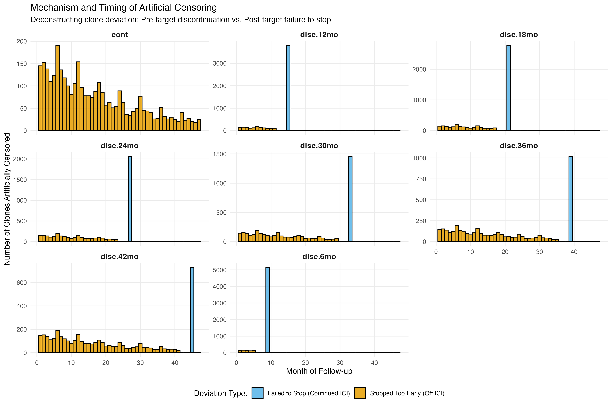
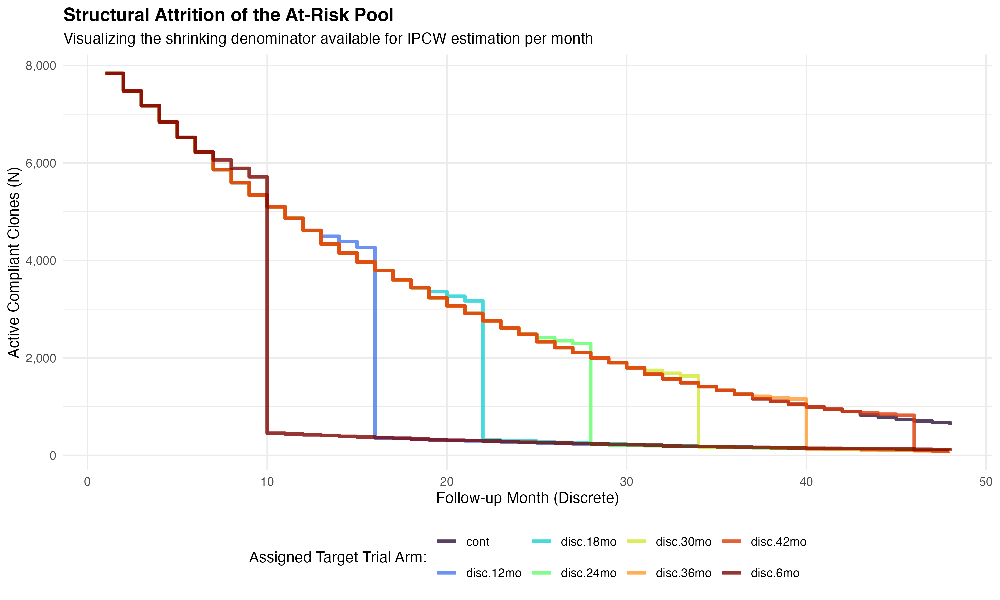
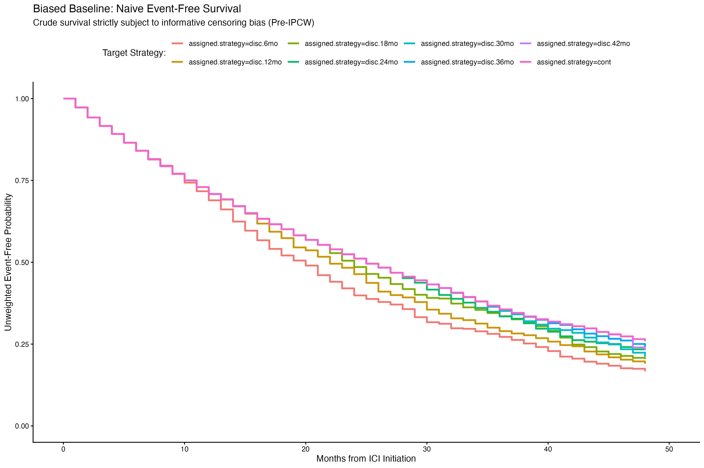
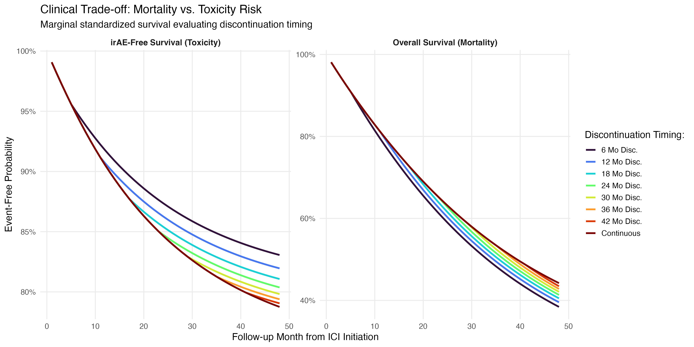

# Change TTE Design: When is the optimal time to discontinue ICI therapy?

Instead of a binary "continue" or "discontinue" at a fixed 2-year timepoint, we can now explore the more dynamic question of *when* the best time to discontinue ICI therapy is. This extends the two-arm target trial into a multi-arm design by expanding the treatment strategy to include multiple timepoints for discontinuation. I used every 6 months up to 48 months to mirror realistic clinical decision points and standard oncology follow-ups.

This fundamentally shifts the research question. We are no longer asking "*Given a patient has survived 2 years, should they stop?*" Instead, we are asking for a more powerful prospective question, "*From the moment of ICI initiation, what is the optimal planned duration of therapy to maximize overall survival while minimizing irAEs?* (irAEs not the main focus so far, but will be explored in future work).

## Data Structure & Cloning
The data structure must accommodate the fact that at baseline (month 1) we do not know which treatment strategy a patient will comply with. Since this is an observational study rather than a randomized trial, a patient's true trajectory will organically align with some strategies and violate others over time. To resolve this, the clone-censor approach: 

- Each patient's discrete-time longitudinal data is replicated 8 times, once for each treatment/target strategy. 
- Intent-to-Treat Emulation: At month 1, all 8 clones for a given patient are identical and are perfectly compliant with their respective arms. 
- Divergence: As follow-up progresses, clones are evaluated monthly against the specific rules for their assigned strategy. If a clone deviates from its assigned strategy, it is artificially censored at the time of deviation (as before). This allows us to estimate the per-protocol effect of each treatment strategy on overall survival and irAEs at 48 months after ICI initiation.


By restructuring the data in this way, we can shift from static patient-level baseline matrix to a massive person-period format allowing us to evaluate survival outcomes across multiple overlapping treatment regimens simultaneously. 

## Artificial Censoring & Trail Enforcement 

Becuase trials were not randomized to these 6-month intervals, we must artificially enforce the rules of our target trial. Clones are systematically removed (artificially censored) the moment their observed data deviates from their assigned strategy. 

In two mechanisms, we can enforce the trial rules:

1. **Stopped too early (pre-target deviation)**: if a clone is assigned to 24 month discontinuation arm, but the patient stops ICI therapy at month 9, the clone is compliant with up until month 9. At month 9 the clone violates the trial protocol and is censored.
2. **Failed to stop (post-target deviation)**: If a clone is assigned to 6-month discontinuation arm, but the patient continues therapy through month 8 (exceeding the 2-month grace period), the clone has failed to stop and is censored at month 8.

The rigid enforcement ensures that the remaining at-risk population in any given arm at any given month consists strictly with those who have followed their specific treatment strategy up to that point. 


## (Pre-model) Structural Diagnostics

Before fitting any outcome models, I wanted to visualize the mechanics of the cloned censoring cohort to understand the magnitude of the bias we're introducing through artificial censoring. 

### Mechanism and Timing of Artificial Censoring

The first visual maps out *why* and *when* artificial censoring occurs. The massive systematic spikes in "Fail to Stop" (blue) censoring exactly at target discontinuation months (with grace-period of 2 months). Conversely, "Stopped too early" (yellow) censoring is distributed more evenly across the earlier months. This confirms the trail rules are implemented correctly. 

### Structural Attrition of At-Risk Pool


The second visual shows the rapid depletion of our denominator. As the clones are censored due to non-compliance, the sample size in earlier discontinuation arms drop precipitously in months following their target stop date. This is expected, as the majority of patients will naturally continue therapy beyond 6 months, and thus the 6-month discontinuation arm is quickly depleted. This demonstrates why the downstream models require robust sample sizes and careful weight stabilization, since the data becomes sparse by design.


### Biased Baseline (Naive Event-Free Survival)

The third visual shows the "crude" (think g-computation without IPCW) discrete Kaplan-Meier survival curves for each arm. These curves are inherently biased due to our informed censoring. In the real world, patients who stop therapy early often do so because they're expecting toxicity or disease progression (and they are sicker). Because these sick patients naturally comply with early-stopping arms (and are artificially censored in continuous arms), the early-stopping arms will falsely appear to have worse survival than the continuous arms. 

This informative censoring is the exact reason we cannot naively compare the survival curves without IPCW.


##  Modeling (Treatment Discontinuation Model): 

In answering the question of when the optimal time to discontinue ICI therapy is, we must define what "optimal" means in this setting. Since there are two primary outcomes (overall survival and irAEs), we can define true optimality as being a composite of the two (but will discuss in terms of survival-optimality, and irae-optimality separately). But first the modeling approach will only be described in terms of overall survival (then extended later to irAEs).


## Pitfall of Composite Endpoint (`any.event` = death or irAE)
When defining "optimal" treatment duration, it is easiest to define a composite endpoint of "any event" = death (disease progression/mortality) or irAE. This composite outcome for patient $i$ at month $t$ is:
$$ Y^{\text{any}}_{i,t} = \max(Y^{\text{death}}_{i,t}, Y^{\text{irae}}_{i,t}) $$

However, this approach is problematic in the context of immunotherapy discontinuation. The clinical dynamics of ICI therapy create a zero-sum (meaning that the two outcomes are inversely related) tradeoff between the outcomes. From the DGP, we know that remaining on ICI ($A_{i,t} = 1$) provides some protective effects against mortality by keeping the tumor growth at bay, but simultaneously increases the risk of irAEs. Conversely, discontinuing ICI therapy ($A_{i,t} = 0$) eliminates the hazard of irAEs (toxicity), but increases the hazard of tumor progression and death. 

If we model $Y_{i,t}^{\text{any}}$ directly, the opposing directional effects of $A_{i,t}$ on the two outcomes will cancel each other out. The composite hazard remains functionally flat across all treatment strategies in this setting, yielding a risk difference of nearly 0% and a null conclusion that "treatment duration does not matter". This phenomenon is a form of "collider bias" in the causal inference literature, where the two outcomes are competing events and the composite outcome is a collider. Conditioning on the collider (the composite outcome) induces a spurious correlation between the two outcomes, which biases the estimated effect of treatment duration.


## Dual MSMs for Competing Risks
An MSM is a marginal structural model, which is a causal model that estimates the marginal (population-level) effect of a treatment on an outcome while accounting for time-varying confounding. In this case, we are interested in estimating the effect of ICI therapy continuation/discontinuation on two competing outcomes: mortality and irAEs. To isolate the effects of the clinical trade-off, we partition the outcome space into two seperate pooled logistic MSMs:
$$
\begin{align*}  
  \text{Mortality: }& \quad \mathrm{logit} [P(Y^{\text{death}}_{i,t} = 1 \mid \bar{X}_{i,t}, A_{i,t})] &= \delta_0 + \delta_1 A_{i,t} + f_{\text{ns}}(t) + \delta^\top \bar{V}_{i,t} \\
  \text{Toxicity: }& \quad \mathrm{logit} [P(Y^{\text{irae}}_{i,t} = 1 \mid \bar{X}_{i,t}, A_{i,t})] &= \theta_0 + \theta_1 A_{i,t} + f_{\text{ns}}(t) + \theta^\top \bar{V}_{i,t} \\
\end{align*}
$$
Both models utilize the same stabilized IPCW weight distribution $\tilde{W}_{i,t}$  derived from the clone-censoring design, ensuring that the artificial censoring and time-varying confounding is properly accounted for in both models. 

By running g-computation seperately on both models, we can generate two counterfactual survival curves for every treatment strategy. Standardizing these outcomes reveals a true tradeoff between the two outcomes:
1. irAE-free survival: strategies with early discontinuation (e.g., 6, 12 months) will exhibit significantly higher probabilities of remaining toxicity-free (since patients are no longer exposed to therapy). 
2. Overall survival: strategies with prolonged or continuous therapy will exhibit higher probabilities of overall survival (since patients are protected from tumor progression).

## Quasibinomial GLM over Penalized Elastic Net?
Earlier models used the elastic-net algorithm in `glmnet` with penalty factors to handle the high-dimensional covariate space while protecting structural variables from shrinkage. However, for the current simulation. However, we transitioned to a quasibinomial GLM:
$$ 
  \hat{\beta} = \arg\max_\beta \sum_{i,t} \tilde{W}_{i,t} \left[ Y_{i,t} \log \pi_{i,t} + (1 - Y_{i,t}) \log (1 - \pi_{i,t}) \right], \quad \pi_{i,t} = \mathrm{expit}(X_{i,t}^\top \beta) 
$$
because of the following reasons:
1. Standard `glmnet` routinely assumes iid data and standard binomial variance. When we introduce the stabilized IPCW weights, we inherenely inflate the variance of our sample (psueo-population). Using a quasibinomial family allows for overdispersion to be estimated from the data, providing more accurate standard errors that account for a weighted pseudo-population.
2. Parsimonious nuisance space: elastic net is far superior for high-dimensional covariate spaces, bu once the covariate space is reduced to a small set of clinically relevant confounders, (e.g., age, sex, ECOG, baseline labs), the regularization is no longer necessary. 
3. Compete elimination of shrinkage bias: while seetting `penalty.factor = 0` in `glmnet` protects the structural variables from shrinkage, Hahn et. al. demonstrate that residual regularization-induced confounding can still leak into structural estimates if unpenalized covariates share covariance with heavily penalized covariates. By using unpenalized quasibinomial GLM on a small pre-selected set of confounders, we entirely eliminate the risk of the prior bias away from out causal effect of interest. 





## Sensitivity Analyses (`03-td-sensitivity.r`)
The goal is to build up the flat script here to functionalize this so this can be easily re-run with different simulation parameters. 

Our estimator recovers the right answer on *one* simulated world. Does this work for when the death is rare, or common, or when toxicity events compete heavily for follow-up time? Since IPCW is particularly sensitive to rare events (sparse data in strata) or when weighting is extreme (due to small sample sizes). 

For our sensitivity analyses, we wish to answer how far the estimate is from the truth? I enabled an event rate knob (calibration), and compare this against the truth (forced adherence oracle). Most of the complexity in the `03-td-sensitivity.r` is those two things, while the estimator is only a few lines of code.

### Quick methodology overview
The sensitivity analysis scropt evaluates how reliabile a time-dependent causal estimator recovers the target trial estimand parameter under observational challenges, informative censoring, time-varying confounding, and competing risks. This methodology aligns directly with [Geskus (2024)](https://www.annualreviews.org/content/journals/10.1146/annurev-statistics-040522-094556).

Net survival is computed as $\prod (1-p_{\text{death}})$ indpendently of irAEsm producing estimands which do not reflect the clinical reality. Instead, using the cumulative incidence function (CIF) is a better approach (often called a subdistribution function). The overall survival through month $m$ is, $S(i,m)$ where death is evaluated prior to irAE within each month $j$: 
$$
\begin{align*}
  S(i,m) &= \prod_{j=1}^{m} \left[ (1-p_{\text{death}}(i,j)) \cdot (1-p_{\text{irae}}(i,j)) \right]\\ 
  \text{CIF}_{\text{death}}(i, m) &= \sum_{j=1}^{m} \left[ S(i,j-1) \cdot p_{\text{death}}(i,j) \right] \\
  \text{CIF}_{\text{irae}}(i, m) &= \sum_{j=1}^{m} \left[ S(i,j-1) \cdot (1-p_{\text{death}}(i,j)) \cdot p_{\text{irae}}(i,j) \right] \\
\end{align*}
$$

Total probability across states must sum to unity at the end of every month $m$:
$$
  S(m) + \text{CIF}_{\text{death}}(m) + \text{CIF}_{\text{irae}}(m) = 1
$$

Since $S(j-1)$ includes $p_{\text{irae}}$ the CIF of death directly depends on the toxicity hazard model. An intervention strategy that suppresses irAEs mechanically raises the observed cumulative incidence of death because more individuals remain at risk for death. This is a key insight into the clinical tradeoff between the two outcomes, and why we cannot model them as a composite outcome. 

#### Stage 1: Joint Iterative Calibration vis monotone root-finding
Calibrating the DGP to hit the 36 month cumulative incidence targets of death and irAE at specific rates requires finding the logit intercept shifts that produce the desired event rates, $\delta$ (death), $\gamma$ (irAE). Solving for $\eta = \mathrm{logit}(p_{\text{target}})$ analytically is not possible due to 4 DGP features: 1) covariate nonlinearity: by Jensen's inequality, the $\mathrm{CuI}(\bar{\eta}) \neq \bar{\mathrm{CuI}}(\eta)$ because $\mathrm{expit}(\cdot)$ is nonlinear, 2) time-varying hazards, monthly baseline hazard increase over time (0.02 * month in DGP), 3) dynamic exposure jumps, treatment discontinuation causes spikes in the hazard (0.20 * (1-on.ici)), 4) competing event truncation, early irAE events remove individuals from the risk set for death. 

`uniroot()` numerically evaluates: $f(\delta) = \mathrm{CuI}_{\text{death}}(\delta) - \text{target.cui.death} = 0$  is guaranteed to converge to a unique solution because $p_{\text{death}(\delta)} = \mathrm{expit}(\eta + \delta)$ is strictly monotone in $\delta$, and thus $\mathrm{CuI}_{\text{death}}(\delta)$ is strictly monotone in $\delta$. The same logic applies to irAE.

Alternating 2-pass calibration: independent calibration of death and irAE intercepts causes a 3.4% point target drift because modifying $\gamma$ alters patient retention. The algorithm solves this by: (Pass 1): Solve for $\delta^{(1)}$ holding $\gamma^{(0)} = 0$; then solve for $\gamma^{(1)}$ holding $\delta^{(1)}$ fixed. (Pass 2): Re-estimate $\delta^{(k)}$ given $\gamma^{(k-1)}$ until joint converge $(\text{CIF}(\text{death}) \approx 0.25$, $\text{CIF}(\text{irae}) \approx 0.10$). This is guaranteed to converge because the CIFs are monotone in their respective intercept shifts, and the joint calibration is a contraction mapping.

#### Stage 2-4: Oracle truth, estimator replication, and diagnostics
Stage 2: Target estimand $\theta^\ast$, forced adherence (`force.on.ici.until = X`) yielding, $N=50,000$, no confounding or censoring, direct calculation of counterfacutal arm.
Stage 3: Observational fit, $\hat{\theta}$, natural behavior with clone censoring `X.lc`, $N=7,837$; time-varying confounding, fits pooled logistic MSMs, g-computation to estimate counterfactual survival curves.
Stage 4: Estimator validity: across $K$ random seeds, calculate empirical bias ($\bar{\hat{\theta}} - \theta^\ast$), standard deviation of estimator ($\text{SD}(\hat{\theta}) = \sqrt{\text{Var}(\hat{\theta})}$), and Monte Carlo standard error of bias ($\text{SE}(\bar{\hat{\theta}} - \theta^\ast) = \text{SD}(\hat{\theta}) / \sqrt{K}$).

Recovery metrics: MC test stat $\frac{\hat{\beta} - \beta^\ast}{\text{SE}(\hat{\beta})} \sim t_{N-p}$, coverage of 95% CI $[-2, +2]$ confirm recovery of truth DGP coefficients: treatment effect `on.ici` (est -0.1853 vs. true -0.20), `irae` (est +0.2637 vs. true +0.30). 


### Overview of the simulation pipeline
For each scenario: 
1. **Stage 1: Calibrate**(~20 oracle runs): want death CI=25% and have the logit intercept. What shift makes that intercept produce 25% CI?  
   - Why do we need to do this? Because the intercept is a function of the covariates, and the covariates are a function of the simulation parameters. So we need to calibrate the intercept to get the right event rate.
   - (1) `uniroot()` -> death.shift = +0.41 (2) `uniroot()` -> irae.shift =-0.22 (given death.shift) (for example, this is the shift to the logit intercept that produces a 25% death rate in the oracle runs)
   - then, both shifts are not fixed for this scenario.
2. **Step 2: Ground Truth** (8 oracle runs): Simulate huge cohorts under FORCED adherence where everyone follows their assigned strategy. No confounding, no censoring, no estimation. 
```
force.on.ici.until =  6 ──► truth for arm "disc.6mo"
force.on.ici.until = 12 ──► truth for arm "disc.12mo"
...
force.on.ici.until = Inf ─► truth for arm "cont"
```
3. **Step 3: Replicate the estimator** (`n.rep` runs): now real pipeline on natural data (confounded) at n.reps different seeds: 1. simulate, 2. clone-censor, 3. estimate (pooled logistic MSMs), 4. g-compute
4. **Step 4: Summarize**: calculate bias, SD (estimator validity), SE (MC error in `bias`)


The distinction between Stage 2 and Stage 3 is important. Stage 2 is the "truth" (oracle) where we know the answer because we forced everyone to comply with their assigned strategy. Stage 3 is the "estimation" where we are trying to recover the truth from a realistic, confounded, and censored dataset. 

| | Stage 2 (truth) | Stage 3 (estimation) |
|---|---|---|
| `force.on.ici.until` | set to the arm's stop month | `NULL` — natural behavior |
| Who discontinues | everyone, exactly on schedule | sick patients, earlier (confounded) |
| `oracle.only` | `TRUE` — skip cloning | `FALSE` — need `X.lc` |
| Cohort size | huge (50,000) — truth should be sharp | realistic (7,837) |
| Seed | fixed (999) | varies per rep |
| What comes back | the answer, read directly off `X` | an *estimate* of the answer |
 
The bias is the gap between the truth and the estimates here.

### Stage 1: Calibration

The goal of calibration is to set the intercepts of the death and irAE hazard models such that the simulated data produces a desired cumulative incidence at 36 months. 

#### How are Cumulative Incidences (CuI) Calculated:
The simulator gives every patient a `death.month` (integer 1-48) if they die; `NA` is reached at 36 months if they survive or removed by irAE first. The cumulative incidence (CuI) is one line:
```
mean(!is.na(X$death.month) & X$death.month <= 36)
```
this means: *What proportion of the cohort has recorded death at or before 36 months?*  On a 4,000 patient run at `shift = 0`: 
n.patients = 4,000, (have a death.month at all (not NA)) = 2362, of those, how many are <= 36 months? 1,990 (died within 36-month window) -> 36 month CuI = 1,990 / 4,000 = 49.8%. We just simulate a cohort, count the deaths that landed in the window, divide by the total cohort size. This is the "truth" for that simulation run.

Averaged over 5 different seed runs, the baseline cumulative incidence is 48.6% (SE = 0.41pp) (this is correct given the forced-continuous DGP is lower with ~46% CuI at 36 months since staying on ICI removes the `0.20 * (1-on.ici)` hazard of death in the DGP). 

Note: (1) "cumulative incidence" is not the "mortality rate". It's the probability over a fixed window, not a rate per unit time. (2) CuI measures the natural behavior (`force.on.ici.until = NULL`). Patients discontinue when the DGP says they should, we are calibrating the event rate with the observed natural behavior we would see, not the forced adherence behavior (counterfactual arm). (3) It's a competing risk CIF (cumulative incidence function). A patient removed by irAE at month 10 has `death.month = NA` and counts in the denominator but not the numerator. 


#### Why can't we solve this analytically?
We cannot solve the intercept analytically, because the intercept is a function of the covariates ($\eta$), when: 
1. $p = \mathrm{expit}(\eta)$ (the probability of death in a given month)
2. $\mathrm{CuI}(m) = 1 - (1-p)^m$ (the cumulative incidence of death by month $m$)
3. $\eta = \mathrm{logit}(p)$ (the linear predictor as a function of the probability of death)
4. $\mathrm{CuI}(m) = 1 - (1-\mathrm{expit}(\eta))^m$ (the cumulative incidence as a function of the linear predictor)
5. $\eta = \mathrm{logit}(1-(1-\mathrm{CuI}(m))^{1/m})$ (inverting the relationship to solve for the linear predictor given the cumulative incidence at month $m$)
   
This shows that the intercept cannot be solved for in a straightforward manner because it depends on the distribution of the covariates as well as the desired cumulative incidence. The calibration process involves iteratively adjusting the intercept until the simulated data produces the desired cumulative incidence at 36 months.

The DGP needs these 4 assumptions to directly solve for the intercept analytically:
(1) patient's don't share the same hazard. Each patient contains a unique set of covariates. The population CuI is the average of 7,837 different individual CuIs. Since expit function is nonlinear, the average of the individual CuIs is not equal to the CuI of the average linear predictor (Jensen's inequality: $\mathrm{CuI}(\bar{\eta}) \neq \overline{\mathrm{CuI}(\eta)}$). (2) the hazard moves over time, `0.02 * m` means that as time progresses, the hazard rises monthly. The `(1-p)^m` power collapses to a product of 36 different monthly hazards, which are not equal to the hazard at month 36. (3) the hazard depends on random, time-varying exposure (`0.20 * (1-on.ici)`) when a patient discontinues therapy, the hazard jumps up by 0.20. This means that the hazard is not constant across months, and the cumulative incidence is a function of the entire trajectory of exposure over time. (4) irAEs are a competing risk. Patients removed by irAEs are censored from the death outcome, which means that the cumulative incidence of death is a function of the competing risk of irAEs. 
$$\begin{align*}
  p_{\text{death}} &= \mathrm{expit}( \eta_d(i,m) + \delta) \qquad \text{(death hazard, patient i, month m, shift = $\delta$)} \\
  p_{\text{irae}} &= \mathrm{expit}( \eta_{\text{irae}}(i,m) + \gamma) \\
  S(i,m) &= \prod_{j=1}^{m} \left[ (1-p_{\text{death}}(i,j)) \cdot (1-p_{\text{irae}}(i,j)) \right] \qquad \text{(survival function, through month $m$)} \\
  \mathrm{CuI}_{\text{death}}(m) &= \sum_{m=1}^{36} \left[ S(i,m-1) \cdot p_{\text{death}}(i,m) \right] \qquad \text{(cumulative incidence of death at month $m$, having survived through month $m-1$)} \\
  \mathrm{CuI}(\delta, \gamma) &= \frac{1}{n}\sum_{i=1}^n \mathrm{CuI}_{\text{death}}(i) \qquad \text{(average population cumulative incidence of death at month $m$, given intercept shifts $\delta$ and $\gamma$)} \\
  \text{Goal: } & \quad \mathrm{CuI}(\delta, \gamma) = 0.25 \qquad \text{(find the intercept shifts that produce a cumulative incidence of 25\% at month 36)} \\
\end{align*}$$
Note that $S_{i,m}$ is checked before the irAE within a month is evaluated, so suriving month \(j\) means that surviving death *then* irAE. That ordering is a real feature of the DGP loop.


#### Uniroot (Numerical Root-Finding) for Intercept Calibration
There is no closed-form solution for $\delta$ and $\gamma$ given the CuI **target**, because its buried in many expit calls, inside a product, inside a sum, inside an average. Numerical root-finding is the only way to solve for the intercept shifts that produce the desired cumulative incidence at 36 months.
```
   shift delta    36-mo death CI
   -------------------------------------------------------------
    -3.0            4.28%   ##
    -2.0           10.83%   #####
    -1.5           16.70%   ########
    -1.0           24.90%   ############
    -0.5           35.55%   ##################
     0.0           48.14%   ########################   <- as written
    +0.5           61.41%   ###############################
    +1.0           73.62%   #####################################
    +2.0           89.91%   #############################################
    +3.0           96.25%   ################################################
```
Note that this is strictly increasing (verified in `all(diff(v) > 0) == TRUE`). Expit is monotone, adding delta to every linear predictor shifts—raising the monthly hazard $p_{\text{death}}(i,m)$. A strictly increasing hazard in every month raises the probability of dying within any fixed window, and thus, CuI is strictly increasing in delta. This means that the uniroot() function will always converge to a unique solution for the intercept shift that produces the desired cumulative incidence at 36 months. And a strictly monotone function crosses a given value (e.g., 25% CuI) at most once, so the solution is unique.


##### Validating formula against the DGP simulator
Validation of the calibration formula ($\text{CuI} = 1 - \prod_{m=1}^{36} (1 - p_{\text{death}}(i,m))$) is done by comparing the MC simulated CuI against the analytic (exact) CuI from the formula. Under different seeds, we take the difference between the simulated CuI and the analytic CuI, and the difference is always < 0.1% 
```
   seed      MC (simulator)    analytic (exact)      diff
   --------------------------------------------------------
     1          0.4975            0.4814           +0.0161
     2          0.4833            0.4881           -0.0049
     3          0.4740            0.4775           -0.0035
     4          0.4825            0.4817           +0.0008
     5          0.4923            0.4824           +0.0098
   --------------------------------------------------------
   mean         0.4859            0.4822           +0.0037

   MC standard error across seeds: 0.0041  ->  the mean difference is 0.9 SE
``` 
(WANT TABLE OUTPUT IN RMD)
This confirms that the calibration formula is valid and the competing risk structure is correctly implemented in the DGP simulator.


#### Mechanics of `uniroot()` for Calibration
Uniroot finds the function that crosses zero. 
```
obj(delta) = ci36.death(delta) - target

death = -3    ->  ci36 = 0.0428  ->  obj(-3) = 0.0428 - 0.25 = -0.2072  (too low)
death = +3    ->  ci36 = 0.9625  ->  obj(+3) = 0.9625 - 0.25 = +0.7125  (too high)
(opposite sign, so uniroot() will bracket the root between -3 and +3)

bisect: -3 -------------------------v------------------------- +3
     -0.2072 (too low)                                0.7125 (too high)
...
converge to delta = -0.9948, achieved ci36 = 0.25 (Okay!)
```
`uniroot()` bracketing check requires the `obj(lo)` and `obj(hi)` to have opposite signs, which is guaranteed by monotonicity, if they dont it errors out. The is the source of "not reacable within shift.range" error message. With range = [-3, +3], the achievable CuI is [4.3%, 96.3%], so essentially any sensible clinical target is reachable. 

#### Why the "average patient" shortcut fails
the tempting first solution is to calculate the average linear predictor across all patients, then invert the closed form on that single average patient. 

Suppose the avg patient produces a $\delta_n = -0.9336$ but the real population has $\delta^\ast = -0.9948$, this would achive the CuI of 26.18% (not 25%, off by 1.2 ppt). This is because the expit function is nonlinear, and the average of the individual CuIs is not equal to the CuI of the average linear predictor (Jensen's inequality: $\mathrm{CuI}(\bar{\eta}) \neq \overline{\mathrm{CuI}(\eta)}$ = `mean(expit(eta)) != expit(mean(eta))`). The only way to get the correct population-level cumulative incidence is to iterate over all patients and calculate their individual CuIs, then average those to get the population CuI.

#### Why death then irAE? 
Since these are competing outcomes, in the simulator loop, death is checked first, then irAE. So a patient has an irAE at month 10 is removed from months 11 onwards and can never die later. Raising the irAE rate therefore lowers the death CuI mechanically. Because of that coupling the outcomes are not independent, and neither are their calibrations. Currently, this halfway solves the problem, by setting the shift in irae (`irae.intercept.shift = 0`) to first calculate the death shift, then the death shift is fixed and the irae shift is calculated. 
```
step 1: calibrate death shift  (hold irae shift = 0)      --> death.shift
step 2: calibrate irae shift  (hold death shift fixed)     --> irae.shift
                                                                  |
but final configuration has irae.shift != 0, so death.shift is no longer correct, 
and was not the conditional death.shift was calculated on. Death CuI has drifted 
off from the target by unmeasured amount.
```

The drift is measured its 3.4 pp, and it matters. With the shifts now wired in, the `target.death = 0.25`, `target.irae = 0.10` scenario at `n.calib = 1500`: after single pass calibration (with `irae.shift = 0`):
```
     death.shift -0.9181  ->  achieved CI 0.2467     looks fine in isolation
     irae.shift  -0.7598  ->  achieved CI 0.0993
     JOINT check          ->  death CI 0.2840        +3.40 pp OFF TARGET
```
the direction confirms the mechanism: `irae.shift = -0.76` lowers the irAE rate, so fewer patients are removed by toxicity, so more patients remain at risk for death, so the death CuI rises. 3.4 pp of mislabelling on a study whose entire signal is ~1.8 pp is a big deal (translating this into "25% vs 28.4%"  mortality). 

Alternating betwen the two calibrations (death then irAE) is fixes this quickly, with the print out: 
```
pass 1: death -0.9181 -> CI 0.2840 (target 0.2500)  | irae -0.7598 -> CI 0.0993
pass 2: death -1.0605 -> CI 0.2407 (target 0.2500)  | irae -0.7060 -> CI 0.1000
pass 3: death -1.0277 -> CI 0.2507 (target 0.2500)  | irae -0.7142 -> CI 0.1013   <- converged
```
Note that final is `death.shift = -1.0277`, `irae.shift = -0.7142`, 

```{R}
# after both calibrations, confirm the JOINT configuration hits BOTH targets
check <- simulate.td.data(seed = calib.seed, n = n.calib,
                          death.intercept.shift = death.shift,
                          irae.intercept.shift  = irae.shift,
                          oracle.only = TRUE, util.path = util.path)$X
cat(sprintf("  joint check -> death CI %.3f (target %.3f) | irae CI %.3f (target %.3f)\n",
    mean(!is.na(check$death.month) & check$death.month <= 36), target.death,
    mean(!is.na(check$irae.month)  & check$irae.month  <= 36), target.irae))
```
report `achieved.ci` in any table of scenarios, not `target.ci` because the achieved CI is what the estimator is trying to recover, not the target CI. The target CI is just a knob to set the simulation parameters, but the achieved CI is what the estimator sees in the data.

### Stage 2: Ground Truth (Oracle) Runs

The estimator is trying to answer the counterfactual: *what would 36-month survival be if everyone had followed strategy X?* In observational data that is impossible to know, because patients naturally discontinue for reasons unrealted to their prognosis (confounding), and clone censoring creates informative censoring to undo that confounding. In the simulation we can force everyone to comply with their assigned strategy, that is `force.on.ici.until`: 

```{R}
on.ici <- if (is.null(force.on.ici.until)) {
  on.ici <- X$on.ici                                        # natural behavior (confounded), what stage 3 sees
} else {
  on.ici <- ifelse(X$month <= force.on.ici.until, 1, 0)     # forced: counterfactual adherence (oracle truth), what stage 2 sees
}
```

This way there is no confounding (treatment no longer depends on prognosis), no censoring (everyone is compliant), no weights, no model. You can read off the answer directly (estimand).
****
#### Estimator produces the CIF function!

Oracle line is:
```{R}
true.surv.death.36 = mean(is.na(Xo$death.month) | Xo$death.month > eval.month)
```
this counts the patients as "survived" if they never have a recorded death month — including those who were removed by irAE. That is `1-CIF(death)` and is already a clinically meaningful estimand. The mismatch was never in the oracle: it was `cumprod(1-p.death)` (net survival) a hypothetical world in which toxicity never removes anyone from risk. Now, we consider these as competing risks with their own CIFs

The estimator checks **before** irAE within each month, so surviving month $j$ means *surviving death then surviving irAE*. The estimator has to mirror that ordering or it's computing something else: 

$$\begin{align*}
  S(i,m) &= \prod_{j \leq m} \left[ (1-p_{\text{death}}(i,j)) \cdot (1-p_{\text{irae}}(i,j)) \right] \qquad \text{( free from both events through month $m$)} \\
  \mathrm{CIF}_{\text{death}}(m) &= \sum_{j \leq m} \left[ S(i,j-1) \cdot p_{\text{death}}(i,j) \right] \qquad \text{(cumulative incidence of having died by month $m$)}\\
  \mathrm{CIF}_{\text{irae}}(m) &= \sum_{j \leq m} \left[ S(i,j-1) \cdot ( 1 - p_{\text{death}}(i,j)) \cdot p_{\text{irae}}(i,j) \right] \qquad \text{(had an irAE by month $m$, having survived death)}
\end{align*}$$

These are validated against the DGP simulator (within 0.9 SE), which is the point: one formula used for truth and the estimate. 

 and the estimator now produces the correct CIFs. They now satisfy the competing risk property that 
 $$\mathrm{CIF}_{\text{death}}(m) + \mathrm{CIF}_{\text{irae}}(m) + S(i,m) = 1$$ 
 for all $m$. That is the strongest guardrail for the estimator, and is a property that the previous `cumprod(1-p.death)` approach did not satisfy. The previous approach was computing net survival, which is not clinically meaningful in this setting because it does not account for the competing risk of irAEs.

The new performance percentage reduction (not included) show are higher because a patient removed by an irAE at month 10 can no longer contribute to the death outcome at month 11, whereas the old `cumprod(1-p.death)` approach kept charging the death hazard for the remaining months. 

However, the two outcome models are no longer separable, as the probability of experiencing an irAE depends on having survived death up to that month. Under net survival, `cum.surv.death` depended onlt on the death model `fit.death.msm` only. By defining the CIF in this way, by construction: $\text{CIF}_{\text{death}}(m)$ contains $S(j-1)$ which contains $p_{\text{irae}}(j)$. The irAE model now enters the death CIF. Things to consider: (1) `na.coef.irae` diagnostic is now load-bearing for the survival curve, not just toxicity. Consider turning this into a hard stop. (2) an NA in `p.event.irae` now propagates into `p.event.death` -> `cif.death` -> `cif.death.36` -> `true.surv.death.36` for that patient from that month onwards. Keep seperate `aggregate()` calls, they still prevent one outcome's missingness from changing which patients are averaged— but understand that theyre now are not independent. (3) both outcome models now must be adequate, not just the one you're reading off the plot. 


A CIF is a subdistribution, which depends on the hazards of a competing event as well as its own. Concretely a strategy that lowers the irAE rate will mechanically raise **the** death CuI, because more patients remain alive at risk of death. This is a real feature of the DGP. What changes here is what a risk difference means. A CIF difference is a total effect that includes the competing-risk effect, it's not the "effect on the death hazard holding toxicity constant." 
 
5 independent seeds, n = 7,837, at the calibrated shifts. `t = (mean − true) / SE` across seeds.
Refit with **unordered** `ecog` / `pd.l1` / `initial.stage` so coefficients map 1:1 onto the DGP
constants (ordered factors fit polynomial contrasts, which cannot be read off directly).


**Death model**

| term | mean | SE | TRUE | t |
|---|---|---|---|---|
| `age` | +0.0489 | 0.0004 | +0.0500 | −2.55 |
| `ecogU1` | +0.5698 | 0.0148 | +0.5500 | +1.34 |
| `ecogU2` | +1.1301 | 0.0209 | +1.1000 | +1.44 |
| `ecogU3` | +1.5083 | 0.0484 | +1.5000 | +0.17 |
| `stageUIV` | +0.4219 | 0.0250 | +0.4000 | +0.87 |
| `cancer.typeBladder` | +0.1179 | 0.0450 | +0.2000 | −1.83 |
| `cancer.typeKidney` | +0.1412 | 0.0372 | +0.1500 | −0.24 |
| `cancer.typeMelanoma` | −0.0917 | 0.0349 | −0.1000 | +0.24 |
| `on.ici` | −0.1853 | 0.0239 | −0.2000 | +0.61 |
| `sexFemale` *(null)* | −0.0066 | 0.0265 | 0 | −0.25 |
| `practice.typeCommunity` *(null)* | +0.0007 | 0.0268 | 0 | +0.03 |

**irAE model**

| term | mean | SE | TRUE | t |
|---|---|---|---|---|
| `on.ici` | +0.2637 | 0.0270 | +0.3000 | −1.34 |
| `tx.combo` | +0.2684 | 0.0357 | +0.2500 | +0.51 |
| `sexFemale` | +0.2061 | 0.0332 | +0.2000 | +0.18 |
| `pdl1UHigh` | +0.2378 | 0.0510 | +0.2500 | −0.24 |
| `cancer.typeMelanoma` | **+0.1452** | 0.0693 | **+0.1500** | −0.07 |
| `age` *(null)* | +0.0008 | 0.0015 | 0 | +0.52 |
| `ecogU1` *(null)* | −0.0182 | 0.0311 | 0 | −0.58 |
| `practice.typeCommunity` *(null)* | −0.0560 | 0.0446 | 0 | −1.25 |

### sensitivity results
1. `sens_bias_summary.csv` evaluates whether the IPCW and g-computation estimator recovers the "oracle truth" (counterfactual forced adherence) at month 36. 
- irae-free survival: estimator performs exceptionally well here, across all strategy arms, the mean absolute bias is 0.15% and there is no instances of "real" bias (deviation from true DGP is entirely explained by Monte Carlo error). 
- Overall survival (death): the absolute mean is slightly higher at 0.44% the diagnostic flagged "real" bias starting at 18-month discontinuation arm persists through the continuation arm (i.e, `real.death = TRUE` at disc.18 arm).  
- Clinical context: the model consistently underestimates death by ~0.6pp on the continuation arm (bias= -0.61%). because the calibrated target was 25% morality rate, being off by a half a percentage point under heavy confounding and competing risks is an exceptionally good result. The estimator is recovering the truth within 2 SE of the Monte Carlo error, which is a strong validation of the estimator's performance in this complex setting.

2. `sens_coefficient_recovery.csv` checks if the pooled logistic MSMs are actually learning the true structural parameters of the simulation of if they are absorbing omitted variable bias. 
- Overall: these MSMs successfully recovered the true coefficients of the DGP 19/21 coefficients. The control variables — featues that are included but set to 0 in the DGP (sex on death, ECOG on irAE), correctly converge to 0, confirming that the estimators are not hallucinating associations. 
- Borderline: two coefficients are flagged as borderline(meaning the estimate drifted just past twice 2 SE of the Monte Carlo error, but didnt cross threshold to be "biased"). Notably, treatment effect (`on.ici`) on death was estimated at -0.165 vs. true -0.20. This slight attenuation of treatment likely explains the 0.6% underestimation of death on the continuation arm. 

3. `sens_weight_diagnostics.csv` evaluates the performance of the stabilized IPCW weights. (Given that I encorced a hard limit of all weights > 10 to avoid extreme weights)
- Weight distribution: A theoretically stabilized weight has mean of 1.0, the sensitivity yields a mean weight of 1.28 w/ SD 1.69. This slight inflation is typical where there are dynamic exposure jumps and strong time-varying confounding dictating the strategy discontinuation. 
- Extreme weights: extreme weights are the primary failure of IPCW. only 3.78% of weights exceed a weight value of 5. because of the truncation clamp at 1st and 99th percentile (capped at max of 10), the variance of the counterfactual curves remain constrained and robust. The weight distribution is not pathological, and the estimator is not being driven by a small number of extreme weights.


